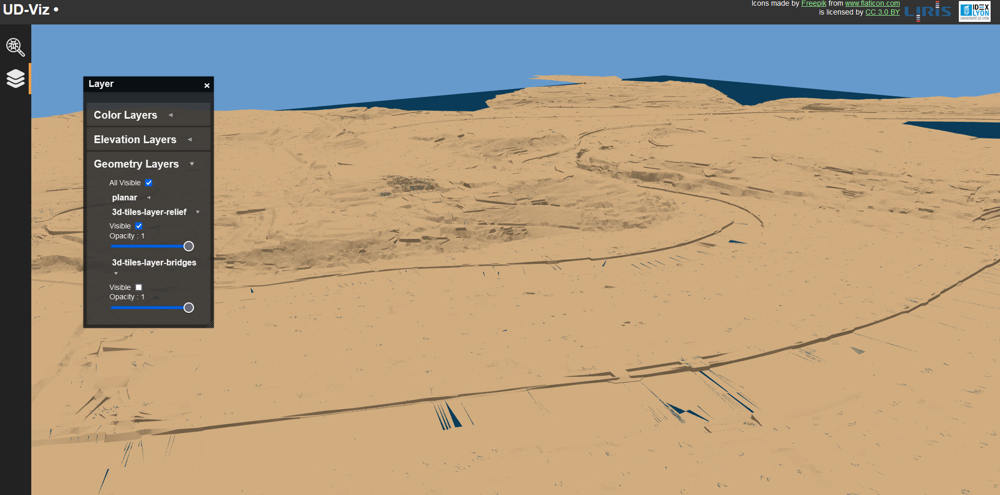
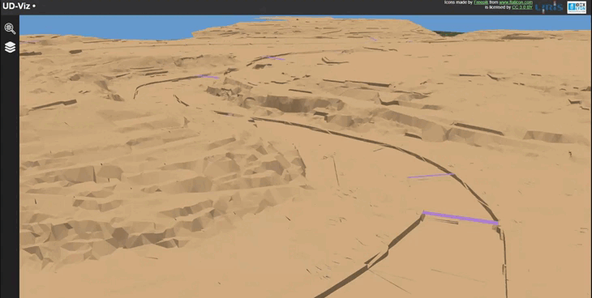
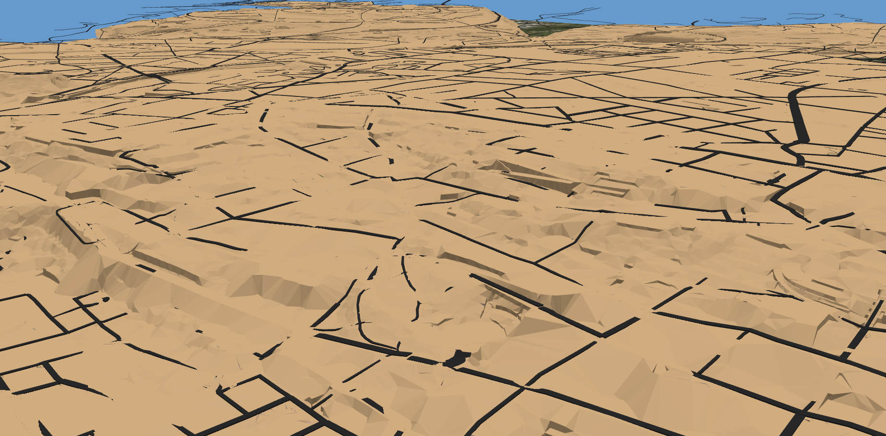
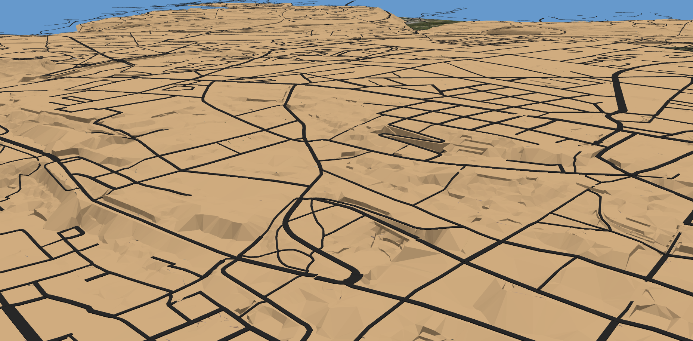

# Roads from 3D relief and bridges

Update drag-and-dropped files by raycasting on 3DTiles models. The files must be __GeoJson__ files containing `LineString` or `MultiLineString` features. The coordinates of those lines will be updated with the altitude (Z coordinate) of the raycast intersection point.  
The raycast only works on visible 3DTiles layers. If you don't want to use relief/bridges to update your altitudes, you can hide the corresponding layer with the `LayerChoice` widget.

Set layers visible/invisible:



Drag and drop:



Roads __before__ update:



Roads __after__ update:




## Installation


* **Ubuntu**

  * Installation

    ```bash
    sudo apt-get install npm    ## Will pull NodeJS
    sudo npm install -g n     
    sudo n latest
    ```

  * References: [how can I update Nodejs](https://askubuntu.com/questions/426750/how-can-i-update-my-nodejs-to-the-latest-version), and [install Ubuntu](http://www.hostingadvice.com/how-to/install-nodejs-ubuntu-14-04/#ubuntu-package-manager)

* **Windows**
  
  * Installing from the [installer](https://nodejs.org/en/download/)
  * Installing with the [CLI](https://en.wikipedia.org/wiki/Command-line_interface)

    ```bash
    iex (new-object net.webclient).downstring(‘https://get.scoop.sh’)
    scoop install nodejs
    ```

## Run application

The application can be locally (on your desktop) started in the following way
```
npm install
npm run debug      # integrates building
```
and then use your favorite (web) browser to open
`http://localhost:8000/`.
